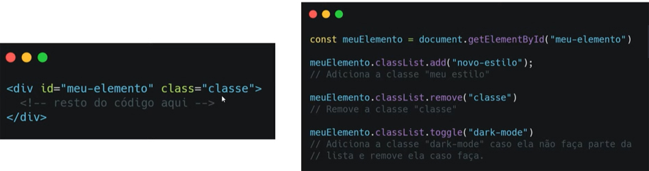

# DOM

#### Document Object Model

- O DOM HTML é um padrão de como acessar e modificar elementos HTML dentro de uma página; estamos falandos dos nós que representam cada elemento que está numa página;


---


# BOM

#### Browser Object Model

- BOM é tudo que está dentro do objeto window; quando abre uma página no browser na internet, a janela é a mãe de tudo, contém todos os elementos que formam a página; é a árvore de dependências que existe dentro da janela;


---


# Métodos

- Estrutura do HTML;

  

  ​

- Selecionando elementos de uma página;

  

  


#### Adicionar e deletar elementos


---


# Estilos

- `Element.classList` - Para criar, remover, adicionar classes CSS dentro do HTML através do JS, é preciso sempre colocar `.classList` **(lista de classe)** que representa a classe que receberá o estilo;

- O atributo **`.toggle`** funciona como um **interruptor:** **se está ligado, desliga; se está desligado, liga;** ele varre todo HTML procurando a classe a ser criada e caso exista, ele retira a tag existente;

  


- O resultado abaixo mostra, após a criação da variável meuElemento e aplicação de estilos;

  

---


# CSS

- Para acessar diretamente o CSS, determinar o estilo de um elemento, caso não exista um arquivo CSS, posso fazer isso direto do JS, buscando a tag ao qual quero criar um estilo; no caso determinei que todas as tag **"p"** *(parágrafo)* terão a cor **"blue"** *(azul)*;

  

---


# Eventos

- Qualquer tipo de ação que o usuário faz numa página da web;
- de mouse: **mouseover, mouseout;**
- de clique: **click, dbclick;**
- de atualização: **change, load;**

---


## Acionar eventos

- Diretamento no JS, cria um evento que será acionado no momento em que o usuário realizar determinada ação;

  ```javascript
  addEventListener //função para adicionar o tipo de evento e o que fazer depois;
  ```

  

- Ele monitora o código o tempo todo e quando acontecer o evento, no caso "click" ele executa a outra função determinada;

#### HTML

- Dentro do HTML é preciso colocar a palavra **"on"** junto ao evento: `onclick` para que ele chame a função e execute o evento solicitado quando houver o click do usuário;

  

---


