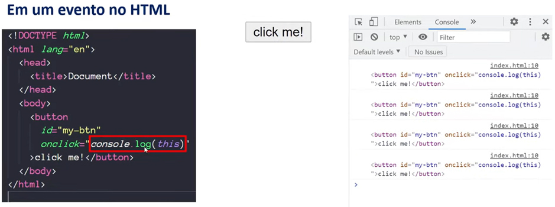
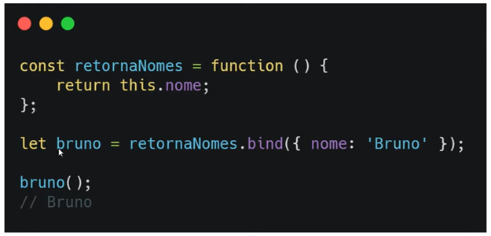

# Estrutura de uma Função

```javascript
function nome(parametros) {
	//instruções
	return //valor de retorno; quando invocamos um "return" a função pára de ser executada e retorna o valor após ele;
}
```

- Variáveis criadas dentro de uma função só podem ser utilizadas dentro dela;

---


## Função Anônima

- Funções que representam uma expressão; uma variável pode armazenar uma função;

```javascript
const soma = function(a, b) {
	return a + b;
}
```

- Quando chamamos a variável e declaramos os parâmetros ela retorna a soma que está na instrução "return" da função;

```javascript
soma(1, 2) //3
soma(4, 5) //9
```

- A constante "soma" é uma função; a função (a, b) não tem nome por isso chamamos de *função anônima*; está relacionada a uma variável, mas não tem nome;

---


## Função Autoinvocável

#### IIFE (Immediately Invoked Function Expression)

#### (Expressão de Função Invocada Imediatamente)

- É função anônima entre parênteses () seguida por outro par de parênteses () que representa sua chamada; é uma função anônima, pois como será chamada logo em seguida (return), por isso não precisa de nome;

```javascript
(
	function() {
		let name = "Digital Innovation One";
		return name;
	}
)();

//Digital Innovation One
```

- Essa é uma função autoinvocável;
- Pode ser utilizada com parâmetros, no caso (1, 2) que seria (a, b);

```javascript
(
	function(a, b) {
	return a + b;
	}
)(1, 2);

//3
```

- Pode ser utilizada com parâmetros e armazenada é uma variável;

```javascript
const soma3 = (
	function() {
		return a + b;
	}
)(1, 2);

console.log(soma3) //3
```

---


## Callbacks

- É uma função passada como argumento para outra; utilizando callbacks você tem maior controle das chamadas;

```javascript
const calc = function(operacao, num1, num2) {
  	return operacao(num1, num2);
}

const soma = function(num1, num2) {
	return num1 + num2;
}

const sub = function(num1, num2) {
	return num1 - num2;
}

const resultSoma = calc(soma, 1, 2);
const resultSub = calc(sub, 1, 2);

console.log(resultSub) //-1
console.log(resultSoma) //3
```

- As variáveis **resultSoma** e **resultSub** chamam a variável **calc**; *callback* é quando substituo o parâmetro **operação** pelas variáveis **soma** e **sub** e declaro os parâmetros **num1 = 1** e **num2 = 2**;
- callback não será executado em ordem de declaração, pois declaramos primeiro a função *"soma"* e depois a função *"sub"*; você pode controlar qual quer chamar primeiro;

---


# Parâmetros

- Como manipular parâmetros de uma função e técnicas para lidar com números indefinidos de parâmetros; 

---


## Valores Padrão

- A partir ES2015 (EcmaScript) tivemos uma melhora na sintaxe, uma forma de escrever a função mais limpa, intuitiva;


---


## Objeto "arguments"

- Um array com os todos os parâmetros passados usando o método **"arguments"** quando a função for invocada;

# 

- No exemplo abaixo visualizamos melhor esse método **"arguments"** sendo executado; a função `showArgs` apenas retorna *arguments*;

```javascript
function showArgs() {
	return arguments;
}

showArgs(1, 2, [2, 3, 4], "string");
```

- Quando chamo a função e coloco os argumentos: 1, 2, um array [2, 3, 4], e uma "string"; ele retorna exatamente o que são os argumentos com toda sua informação; 4 elementos: 2 números, 1 *array* e 1 *string*; começando do índice **zero(0)** como se fosse um **array**, um objeto **iterável**; tem a propriedade **lenght**;


---


# Arrays e Objetos

## Spread

- É uma forma de lidar separadamente com os elementos de um array; o que era parte de um array, se torna um elemento independente; 


- A forma de escrever um spread é colocando **3 pontos (...)** antes do nome da função declarada como um array:

  ```javascript
  const numbers = [1, 2, 3];

  console.log(sum(...numbers));
  ```

  onde serão adicionados os valores da variável quer será enviado na ordem: **1 = x / 2 = y / 3 = z** no console.log que corresponderá a função sum (x, y, z);

---


## Rest

- Ao contrário de **spread**, combina os argumentos de array;


- O que era um elemento independente se torna parte de um array; você usa quando está declarando a função:

```javascript
confereTamanho(); //0
confereTamanho(1, 2); //2
confereTamanho(3, 4, 5) //3
```

---


# Objetos

## Object Destructuring (Desestruturação de Objetos)

- É a propriedade que entre { }, podemos filtrar apenas os dados que nos interessam em um objeto;

  

  no exemplo, crio as funções com os objetos específicos que quero filtrar na minha variável:

  ```javascript
  function userId({id}) {
  	return id;
  }

  function getFullName({fullName: {firstName: first, lastName: last}}) {
    	return `${first} ${last}`;
  }

  userId(user)
  //42

  getFullName(user)
  //John Doe
  ```

  onde como argumento entre **"{}"** declaro qual dado será filtrado na variável principal `const user = { }`; quando invoco as funções `userId` e `getFullName` com o argumento user, o valor retornado será: 42 e John Doe; quando escrevo: `firstName: first`, os **"(:)"** me permite renomear minha variável **`firstName`** para **`first`**;.


---


# Loops

- É uma das mais famosas declarações do JavaScript; sempre haverão loops em qualquer código JS, eles servem para verificar se uma declaração é verdadeira ou falsa; O JS confia nessas declarações, loops;

## if/else

- Abaixo a forma correta de declarar um **if** e **else** para verificar se a função `numeroPositivo(num)` é *verdadeira* ou *falsa*; quando chamadas na função com argumentos retornam a condição: `numeroPositivo(2);` *//true* - `numeroPositivo(-9);` *//false*


---

- Algumas formas de declarar a condição if/else para um código mais limpo;


- No modelo 2 armazeno a variável `const ehNegativo = num < 0;` dentro da função para comparar o *if/else* para deixar o código limpo e de fácil entendimento; 

  No modelo 3 retiro a função `let resultado;` para poupar a memória, mantenho o if, retiro o else e incluo `return true;`,  que após a comparação sairá da função; return sempre encerra a função;


- No JavaScript sempre se escreve **else if** com espaços entre as palavras; é regra;

  ​

## switch

- Switch/case é utilizando quando se tem muitas comparações e o **if** ficaria muito grande; é uma comparação de **tipo e valor**; sempre precisa ter um valor **"default" (padrão)**; 


- No exemplo mostra que quando você declara uma função que não corresponde a nenhum valor declarado no `switch(id)` com números inteiros: **1, 2, 3,** ou algum que não exista, por **"default" (padrão)** retorna **"peixe"**; 

  ```javascript
  getAnimal("1") //"peixe"
  ```

  Ele entende que é uma **string** e retorna **"peixe"**;


---


# for

- É um loop dentro de elementos iteráveis (arrays, strings);


- o for inicia entre **()**; crio a variável:

  ```javascript
  let i = 0; //índice = 0;
  ```

   enquanto `i` for menor que o tamanho do array; `i++; (incrementar) //somar + 1`; multiplicar o array por 2; 

## for... in

- Loop entre propriedades enumeráveis de um objeto; não é **iterável**, segue uma ordem; **for in** é utilizado para objetos; 


- 1º caso: 

  quando chamo a `prop` (propriedade) ele retorna todas as **propriedades do objeto**; 

```javascript
for(prop in obj) {
	console.log(prop)
}
//nome
//idade
//cidade
```

- 2º caso: 

  se eu quiser retornar o **valor de cada propriedade**, basta chamar a função e colocar a propriedade (`prop`) entre colchetes;

```javascript
for(prop in obj) {
	console.log(obj[prop]);
}
//nome
//idade
//cidade
```

for... of

- Loop entre estruturas iteráveis (arrays, strings);


- **strings**: retorna letra por letra da palavra declarada na variável;

```javascript
const palavra = "abacaxi";
```

- **números**: retorna cada número em sequência do array declarado na variável;

```javascript
const nums = [30, 20, 233, 2];
```

---


## while

- Executa instruções até que a condição se torne falsa;


- Enquanto a variável `let num = 0;` for menor ou igual a 5, `num++` (incrementar, somar +1); quando chegar a 6 a função pára de rodar;

## do...while

- Executa instruções até que a condição se torne falsa, porém a primeira execução sempre ocorre;

  `let num = 6;` retorna 6, vai executar a validação da condição `while(num <= 5);` e parar;


---


# this

- É uma referência para o contexto; no exemplo **this** refere-se ao objeto **pai do método**: `pessoa`; **this** declarado dentro de um objeto se refere a ele;


- Quando uma função está dentro de um objeto é chamada de método, no caso objeto `fullName`;

```javascript
fullName : function() {
	return this.firstName + " " + this.lastName;
},
getId: function() {
    return this.id;    
};

pessoa.fullName();
//"André Soares"

pessoa.getId();
//1          
```

- quando chamo a variável `pessoa.fullName();` declaro **this** e refere-se a variável e a propriedade ao qual está associado: 

​	**this = pessoa** - *this.firstName* e *this.lastName*;

​	**this = pessoa** - *getId - this.id*

---




---


## Manipular o valor de this

## call

- Utilizado para chamar uma variável específica através da referência **this**; é possível passar parâmetros para uma função separados por vírgula, como nos exemplos 1, 2 e 3 abaixo:


## apply

- Funciona de forma igual ao call, mudando somente quando especificarmos parâmetros dentro da função entre colchetes [] como array;


- Parâmetros como array;


## bind

- Clona a estrutura da função onde é chamada e aplica o valor do objeto passado como parâmetro; a variável deve ser chamada como uma função, seguida de "**()**":

  

- No exemplo `bind` clonou a função `retornaNomes` e mudou o valor do parâmetro `nome` para `'Bruno'`; o valor de this é o objeto declarado em `bind`;

  ```javascript
  let bruno = retornaNomes.bind({ nome: 'Bruno' });

  bruno();
  //Bruno
  ```

---


# arrow function

- É representada pela **arrow** (seta) "**=>**" daí o seu nome; está sempre associada a uma `constante`, `variável` onde tem seu valor armazenado; exemplo:

  **1** - a variável declarada; 

  **2** - como reescrevê-la utilizando **"arrow function"**, onde a palavra `function` é retirada e deixa os "**()**"; 

  **3** - a variável declarada de forma simplificada; quando a **arrow function** for uma função muito pequena, só tiver uma linha, não é necessário o `return` e nem as "**{}**", só coloca a sua operação ou que quiser retornar;


---

- Caso exista apenas uma linha, pode dispensar as "**{}**" e o `return`;
- E só um parâmetro, pode dispensar os "**()**";


---

- **arrow function** não faz **hoisting**, por está sempre armazenada dentro de uma **função**; tem que declarar antes de chamar; como acontece no exemplo 2;

  **hoisting** - somente a palavra reservada "**var**" faz hoisting; quando você declara a variável antes da função; o JS entende que função irá passar para uma posição antes da variável e então ela será declarada, como no exemplo 1;


## Outras restrições arrow function

- "**this**" sempre será **objeto global**; métodos para modificar seu valor não funcionarão;
- Não existe o objeto "**arguments**";
- O **construtur** (ex: **new MeuObjeto()**) também não pode ser utilizado;
- Não façam **arrow function** serem métodos de objetos; para métodos sempre utilizem uma função comum;

---


