# JavaScript Assíncrono

- É o não ocorre ou não se efetiva ao mesmo tempo;

  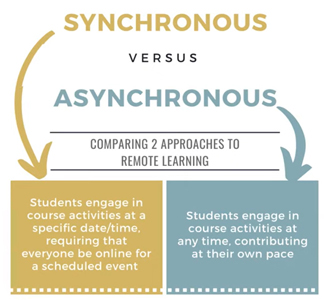

  1. SÍNCRONO - os estudantes precisam executar as atividades numa data e horário específico, não podem fazer outras atividades durante o evento;

  2. ASSÍNCRONO - os estudantes podem realizar suas atividades em qualquer dia e horário; podem realizar outras tarefas durante o evento; como no estudo *home office* em que as aulas ficam disponíveis e cada um faz seu horário;

  3. O JavaScript é síncrono, executa um processo de cada vez; ao passo que no assíncrono posso fazer mais de uma tarefa por vez;

     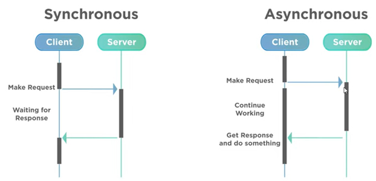

---

### Promises

- Objeto de processamento assíncrono com valor inicial desconhecido, que pode ser resolvido ou rejeitado; como no caso de ingressos para cinema, shows; o ingresso é a promessa de acesso ao evento irá acontecer, não tem o resultado; se ocorrer algum imprevisto podemos perder tal evento;

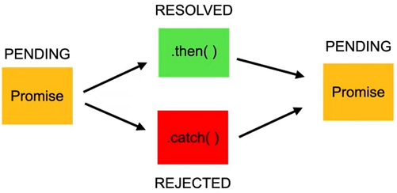


- Possui 3 estados: 

  `Pending` - Pendente

   `Fulfilled` - Realizada

   `Rejected` - Rejeitada

  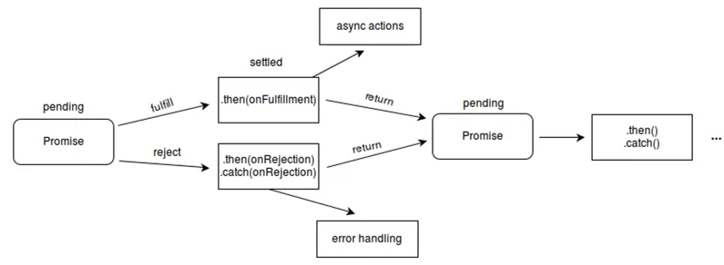

Estrutura de uma promise

- utilizar a palavra `new` e dentro dela colocar os parâmetros: `resolve`, `reject` que são o *callback* dela;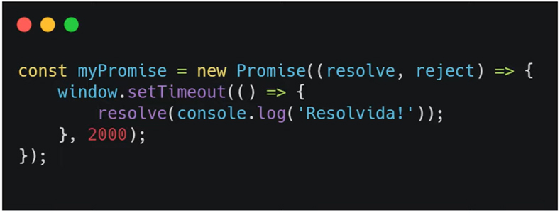
  - Quando a variável `myPromise` receber o valor, só vai dizer que é uma `promise` e nada vai acontecer e semente após 2 segundos, retorna o `console.log` com a palavra *'Resolvida'*;

  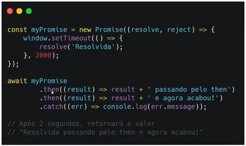


  - Podemos encadear algumas chamadas de uma `promise`, no caso utilizando a propriedade `await`; posso ter mais de um `then` caso a operação passe e um `catch` caso dê erro; 
  - Para pegar o resultado de uma promise resolvida ou rejeitada é preciso utilizar a palavra `await`;

---

### Async e Await

- Funções assíncronas precisam dessas duas palavras chave; sempre que for resolver uma promise preciso utilizar essas palavras;

  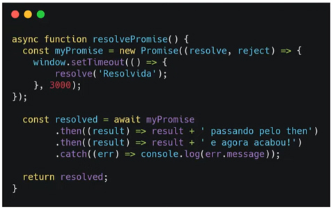

- Sempre que criar uma *função assíncrona*, preciso utilizar a palavra `async` para identificá-la e `await` para parar o código e esperar a promise ser resolvida, para o código continuar rodando; sempre que quiser o resultado da sua `promise`, utilize a palavra `await`;

  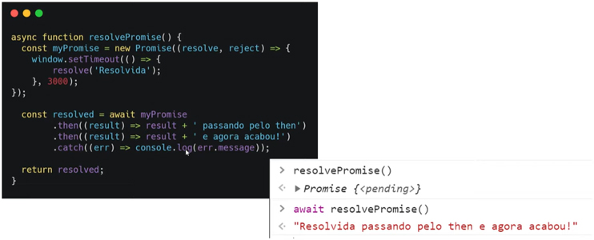

- Quando tiver uma *função assíncrona* não pode simplemeste chamá-la, pois o resultado será que está pendente; uma `promise` resulta outra `promise`; é preciso utilizar a palavra `await` na função para receber o resultado;

  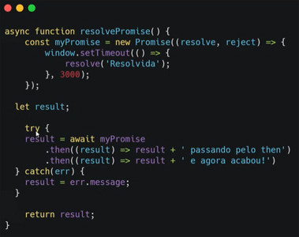

- Podemos também utilizar as propriedades try...catch; no try coloco o resultado caso não dê nenhum erro e no catch, caso ocorra erro;

---


# Consumir APIs

#### (Application Programming Interface) 

- É uma forma de intermediar os resultados do back-end com o que é apresentado no front-end; Para acessá-las utiliza-se URLs.

  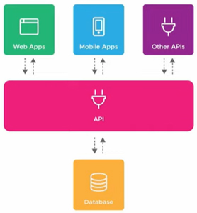

  - No exemplo, vemos o um banco de dados (*database*) no caso back-end, sendo acessado uma *URL que utiliza uma API* se comunicando com aplicativos em diversos tipos de *plataformas*;

    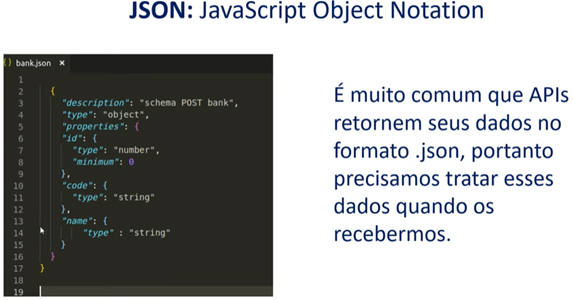

    - JSON é um formato de objeto representado por **[]**, **{}** e **valores**;

---

Fetch

- A sintaxe 

  ```javascript
  fetch(url, options)
  ```

  utilizar a palavra fetch, que receberá os tipos de opção para uma requisição;

  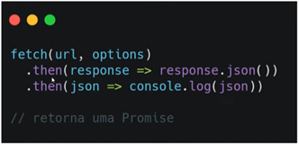

  ​

  - Posso ter encadeamento utilizando **then** e sempre converter a sua resposta para **json**, caso ela venha como uma *string* para que possa utilizar dentro do `JavaScript`;  o fetch retornará uma promise; você precisa utilizar o await quando usar o fetch;

- Podemos fazer diversas operações no banco de dados (**POST, GET, PUT, DELETE, etc**);

  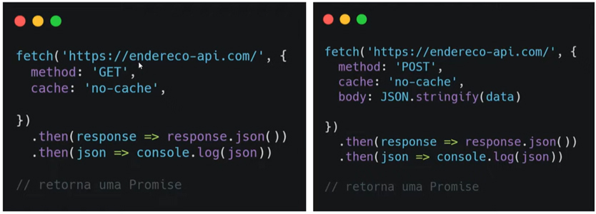

---

