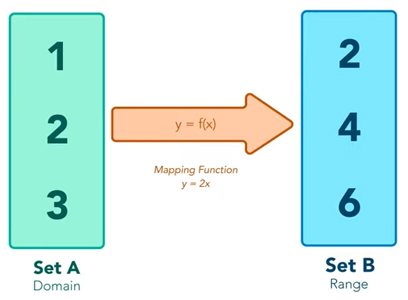
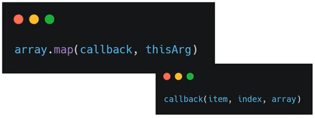
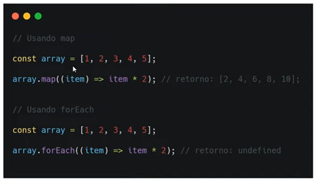
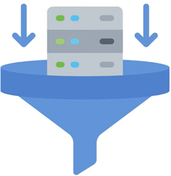
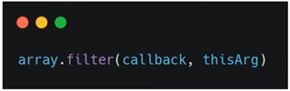
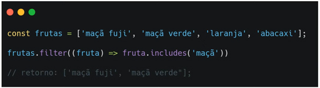
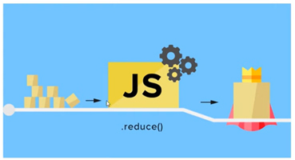
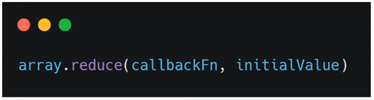
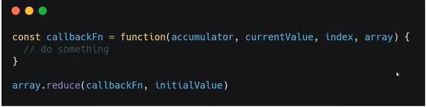

# Map, Filter, Reduce

- são métodos importantes para lidar com arrays;

---


## Map

- É quando um conjunto passa por alguma operação e se torna outro conjunto; **SET A** *(array1)* passou pela operação **"Mapping Function (função de mapeamento)"** se tornou **SET B** *(array2)*, que é o nome do método utilizado; 
- O retorno da função **"Mapping Function"** cria um novo array; não modifica o array original;
- Realiza as operações em ordem para cada elemento, começa no **index = 0** até o final do array;



## Sintaxe

- Para escrever o método dentro do código JS: 

  colocar depois do array **".map"** e pode receber 2 argumentos: **callback**, **thisArg**;

  **callback:** função executada em cada elemento, com acesso: ***item*, *index*, *array***; utilize o que for necessário;

  **thisArg (opcional)**: valor de "this" dentro da função callback;



---


## Map vs forEach

- **forEach**: método de comparação que faz uma operação em cada elemento do array;

  a diferença entre **map** e **forEach** é o valor retornado e se precisa de um array auxiliar;



- **map** - quando escrevo `array.map`, **item** é minha função de *callback* utilizando uma *(arrow function =>)*, o que retorna um novo array da função multiplicando cada elemento por 2;
- **forEach** - é a mesma sintaxe, porém retorna **"undefined"**; é preciso colocar essa operação dentro de uma constante para utilizar o array que resultou essa operação;

---


# Filter

- É um método para filtrar o array e de acordo com cada operação retorna um resultado;
  - cria uma novo array apenas com os ítens que passaram pelo seu filtro;
  - não modifica o array original;



## Sintaxe

- É exatamente igual ao map e recebe os mesmos argumentos: **callback**, **thisArg**;



​	**callback**: função executada em cada elemento, com acesso: ***item*, *index*, *array***; por ser um filtro, será uma comparação;

​	**thisArg (opcional)**: valor de "this" dentro da função callback;

Exemplo:




- Na operação a função de *callback* quero apenas o **ítem**, e sempre será o primeiro *argumento*: `(fruta)` e utilizo o método `includes` para incluir uma *string* específica no filtro;

  ```javascript
  frutas.filter((fruta) => fruta.includes('maçã'))
  ```

  retornará uma lista *(array)* todos os ítens que incluam essa *string* no argumento `fruta` **('maçã')**; um *novo array* com 2 ítens filtrados, apenas os elementos que passaram pela validação no *callback*;

  ```javascript
  //retorno: ['maçã fuji', 'maçã verde'];
  ```

---


# Reduce

- Diferente dos métodos **map** e **filter**, **reduce** executa a função em todos os elementos do *array* e retorna um **valor único**, não outro *array*;

Exemplo:



- Uma pilha de elementos quadrados separados e utilizando o método `reduce()`, me retorna um todos em **objeto único**; pode ser: *array, string, número*; será um valor diferente do que foi enviado inicialmente;

## Sintaxe

Para implementar o método `reduce: array.reduce` com os argumentos **callbackFn**, **initialValue**;



- **callbackFn**: função a ser executada a partir do elemento que será o acumulador; 
- **initialValue**: valor em que o retorno final irá atuar;
- o argumento **callbackFn** tem acesso: ***accumulator, currentValue, index, array***;



- **accumulator ou prevValue**: é o acumulador de todas as chamadas em **callbackFn**; assume o valor do resultado anterior cada vez que executar a função;
- **currentValue**: elemento atual acessado pela função;
- Não é necessário utilizar todos os argumentos da função **callbackFn**

---


