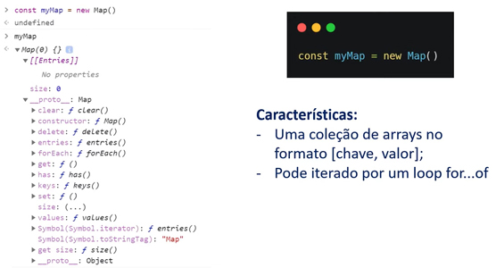
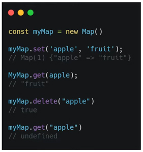
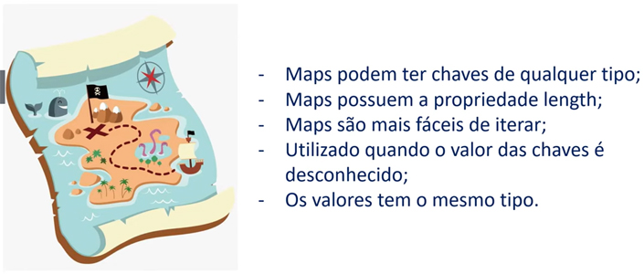
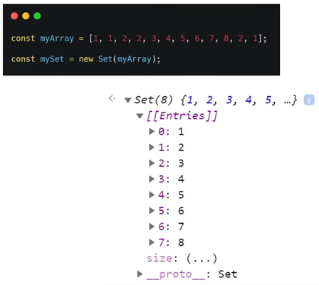
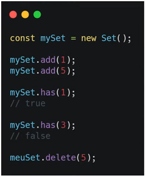
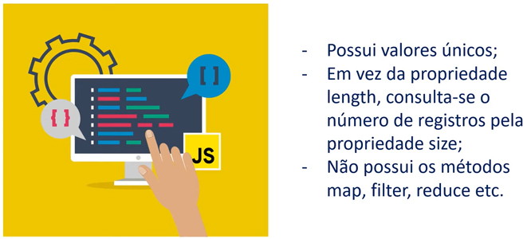

# Map

- uma coleção de **arrays** no formato: **chaves {} e valor**; pode ser iterado por um loop **for...of**; é declarado da seguinte maneira: 

  ```javascript
  new map()
  ```



---


## Métodos

- Adicionar, ler e deletar elementos;
- Adicionar - **set**; configuro que minha **chave *('apple')*** e **valor *('fruit')***;
- Ler - **get**; coloco a *chave* entre aspas *('apple')*,
- Deletar - **delete**; coloco a *chave* entre aspas *('apple')*; após deletado, se tentar ler usando **get**, retorna o valor "*undefined*", pois não existe mais;



---


## Map vs Objeto



---


# Set

- São estruturas que armazenam **valores únicos**;

- Enquanto num array posso ter valores repetidos, num **set** somente valores únicos; **nunca se repetem**;

  A forma de declarar um set:

  ```javascript
  new Set();
  ```

  

---


## Métodos

- Adicionar, consultar e deletar;
- Adicionar - **.add** - coloco os argumentos entre ();
- Consultar - **.has** - vejo os elementos de um **set** existente e retorna **true**, caso contrário, retorna **false**;
- Deletar - **.delete** - deleto um elemento específico;



---


## Set vs Array

- A diferença:

  **set** - tem um número limitado de operações; 

  **array** - tem um número muito maior e mais flexível de operações;



---


