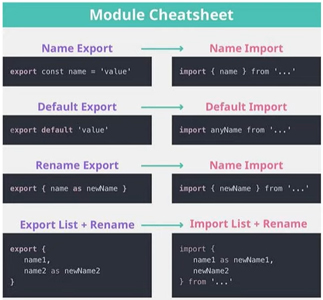

# Módulos

- Arquivos JavaScript com a capacidade de **importar** e **exportar** informações de **outros arquivos** do mesmo tipo;

  

### Vantagens

- Organização do código; cada arquivo tem sua própria responsabilidade: funções, variáveis...;
- Compartilhamento de variáveis em escopos diferentes;
- Explicita as dependências dos arquivos;

---


## Exportar

- Existem 2 formas de exportar: **Named Exports** e **Default Exports**;

  #### Name Exports

  - Quando precisa exportar mais de uma coisa de um arquivo;
  - utilizar a palavra **`export`** reservada do JS antes da palavra **`function`** na hora de declarar;
  - declarar as funções e depois utilizar **`export`** e entre **`{}`** colocar o nome de todas as funções que você deseja exportar;

  

  ​

  #### Default Exports

  - Só pode haver um default exports por arquivo;
  - Será o retorno padrão do seu arquivo;

  

---


## Importar

- Existem 2 formas de importar: **Named Exports** e **Default Exports**;

  #### Name Exports

  - Utilizar a palavra **`import`**  reservada do JS e entre **`{}`** colocar todas as variáveis, classes, funções que deseja importar, depois das chaves colocar a palavra **`from`** reservada do JS com o caminho (path) do arquivo; sempre iniciando entre **""** *(simples ou duplas)*:

  ```javascript
  './ + nome-arquivo + .js' ;
  ```

  

  ​

  #### Default Exports

  - Utilizar o mesmo processo do **Name Exports**, porém sem as chaves e com o **Default Exports** *(nome padrão)* do seu arquivo;

    

  ​

  #### Apelidos

  - Facilita muito trocar o nome de um **`import`** e dar um **"apelido"** para uma função;
  - basta colocar entre **`{}`** depois do nome do arquivo as palavras **`as`** reservadas do JS e o apelido que você deu para aquela função;

  

  ​

  #### Utilizar * (asterísco)

  - Basta colocar um **`*`** para importar tudo de um arquivo com o apelido;

  - Declarar a função com o `apelido.` e nome do método, variáveis, funções... 

    ```javascript
    INFOS.metodoA();
    ```

    

---


# Vinculando ao HTML

- É preciso colocar dentro da tag "<script></scritpt>" colocar o **atributo** **`type`** com o **valor** **`module`** (**`type="module"`**) para o **HTML** e o **browser** (*navegador*) entenderem que você está utilizando a sintaxe de módulos;

  

- Para fazer teste localmente *(arquivo no seu computador)* é preciso instalar a extensão **"Live Server"** no **VSCode** para seu computador rodar como um **servidor local**;

---


# Curiosidades

- Módulos sempre estão em **"strict mode"** (modo restrito);
- Podem utilizar as extensões **`.js`** ou `.mjs`;
- Arquivos `.mjs` são mais incentivados quando se utiliza módulos;
- Para testes locais é necessário utilizar um **servidor**;
- Ao importar:
  - sempre colocar as extensões **`.js`** ou **`.mjs`**;
  - sempre utilizar "**`./`**" como ponto de partida;



---

