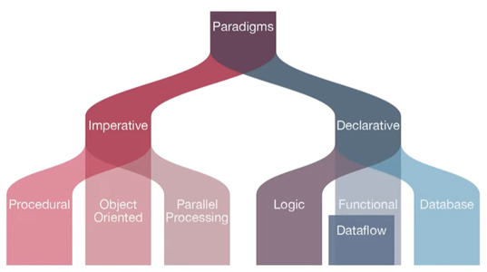
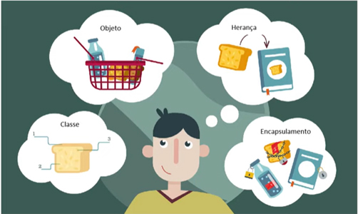
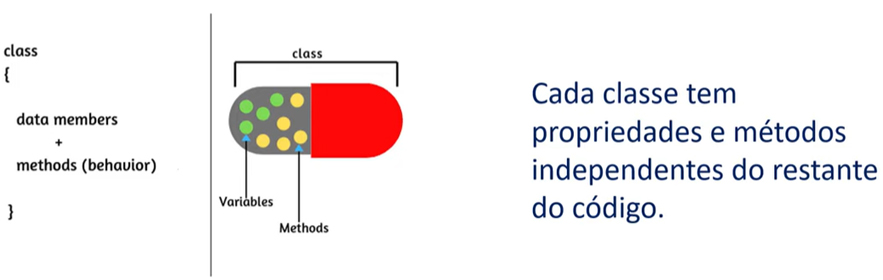
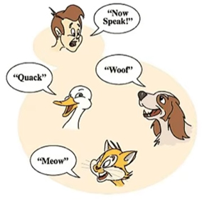
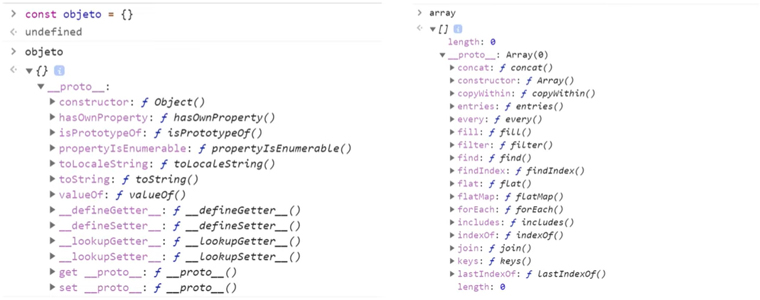
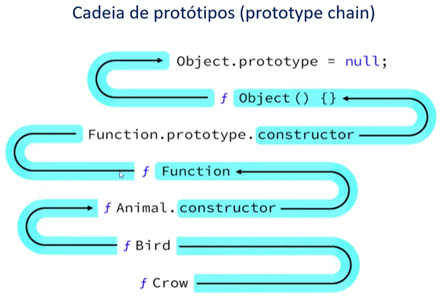
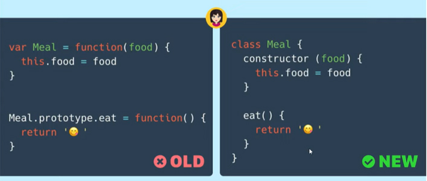
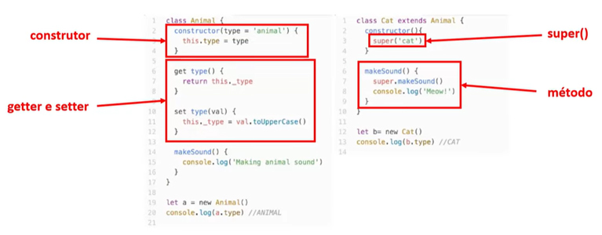

# Orientação a Objetos

### Paradigmas da Programação

- Os paradigmas podem ser imperativos ou declarativos;

  

  ##### Imperativos

  - Foca em como você resolverá os problemas: processos, orientação a objetos, processos paralelos;

  ##### Declarativos

  - Foca no que e em que você irá fazer: lógica, fluxo de dados funcional, banco de dados;

  ​

- Na orientação a objetos os programas são **objetos** que possuem uma série de propriedades;

  

  **Pilares**:

  ​	• Herança • Polimorfismo • Encapsulamento • Abstração

#### Abstração

- Processo mental que consiste em isolar um aspecto determinado de um estado de coisas relativamente complexo, a fim de simplificar sua avaliação, classificação.

#### Herança

- O objeto filho com suas características herda propriedades e métodos do objeto pai.

#### Encapsulamento

- Cada classe tem propriedades e métodos independentes do restante do código.

  

#### Polimorfismo

- Objetos podem herdar a mesma classe do pai, mas se comportarem de forma diferente quando chamamos seus métodos.

  

---

# OOJS

### Orientação a Objetos em JavaScript

#### Protótipos

- É o esqueleto de todos os objetos. Todos vão herdar propriedades e métodos do `prototype`; o objeto `object.prototype` está no topo da cadeia;

  

  - No prototype do array existem vários métodos além dos que aparecem na imagem; é só um exemplo dos diversos tipos de propriedades que pertecem ao objeto ou array;

- Cadeia de Protótipos

  - No exemplo abaixo vemos como se comporta a cadeia de protótipos do **objeto Crow** (corvo) até se tornar nula;

    

#### Classes

- É apenas uma sintaxe para facilitar a escrita e a gente sempre utiliza objetos que tem protótipos;

  

  ​

- O JS não possui classes nativamente. Todas as classes são objetos e a herança se dá por protótipos;

  

  - **constructor** - sempre que criar uma classe todos os parâmetros passados vão dentro do **construtor**, é essencial; no caso o tipo é animal `type animal`;

  - **getter e setter**

    **get** - para ter acesso a um parâmetro de um objeto qual o tipo;

    **set** - para determinar que tipo tem o outro valor;

  - **super** - envia para função **pai** (`class Animal{}`)os parâmetros que estão nela quando se quer fazer herança; na funçao pai o tipo é `animal`, mas envio o tipo `cat`;

  - método - está na classe **pai** (`class Animal{}`), mas posso reescrevê-la de outra forma na classe **filha** (`class Cat extends Animal{}`) ;

---

