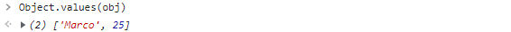
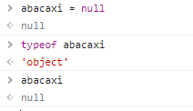

# JavaScript

### Estrutura de Dados

### 

A estrutura de dados do JS é **dinâmica**, ou seja, você pode modificar o *tipo de valor* em uma variável. Se uma variável é uma **string**, posso declara-la novamente como **number**. Conforme o programa vai rodando você pode modificar o tipo dela. Para visualizar o tipo de utilizando dentro da variável, basta digitar o comando: *typeof + nome-variável;* Ex: 

```javascript
typeof um
```

Ex:

```javascript
let um = "um";

um

"um"

typeof um

"string"


um = 1

1

typeof um

"number"
```

---

## Tipos

#### **Tipos Primitivos**

- Não tem métodos dentro deles; numbers, strings, boolean, null, undefined; são escritos com letras minúsculas;

#### **Tipos Não Primitivos**

- Contém métodos dentro deles; objects e arrays;


---


# String (Texto)

* São utilizadas basicamente para **texto**; valores sempre declarados entre **aspas** ("") ou **crases** (``); podem ser *interpoladas*, ou seja, escrever uma **string** com **variáveis** ou até **html**, dependendo de como está consumindo essa string dentro do código; são as *templates strings*. 

Ex: 

- onde declaro a função *fullName* como uma parte de texto e passar junto as variáveis *firstName* e *lastName*, utilizando o *dólar* **${firstName}** e entre chaves;


---

#### object (objeto)

- - Para transformar uma *string* em **object** (objeto) basta escrever a palavra **String** com a letra **S** em maiúsculo e o texto entre aspas dentro de parênteses: **let exemplo = new String("blablabla");** o comando **typeof** me mostra que é um objeto: *typeof exemplo* = ***'object'***; retorna todo conteúdo dentro do índice; **prototype**: métodos que posso utilizar em uma string; 

    

  - Não confundir ***tamanho*** com ***índice***; o *índice* começa do **0 (zero)** e o *tamanho* começa do **1 (um)**; quando chamo uma variável e coloco o número entre colchetes [], estou chamando um índice: **var nome = "João"** / **nome[1]**  / **"o"**; para saber o tamanho: **nome.lenght** / **4**; 

  - para **concatenar** uma *string* com outra e ter um *espaço em branco* **(" ")** entre elas, basta escrever da seguinte maneira:  **concatenado = nome + '' '' + sobrenome;** onde as asplas duplas com espaço em branco entre elas, separam o valor de cada string informada: **"João Pedro"**; com as atualizações pode ser escrito também: **concatenado = `${nome} ${sobrenome}`**, escrito entre **crases ``** = **"João Pedro"**

  - quebrar uma linha no concatenado: concatenado = *nome + **''\n''** + sobrenome;* com atualizações pode ser escrito também: **concatenado = `${nome}`**

    **`${sobrenome}`** , basta pressionar **`enter`** depois da primeira variável;

    **"João**

    **Pedro"**

    para pular mais de uma linha basta acrescentar **\n** quantos quiser dentro das apas; é uma opção do JS,  *JavaScript scapes*; 

  - utilizando a **crase (`)** fica mais fácil colocar qualquer de elemento, sintaxe dentro de uma variável num código em JS;

    

---


# Numbers (Números)

- São variáveis do tipo número: ***inteiros ou decimais***; é declarado **sem aspas ""**;

- Pode fazer operações aritméticas: *adição, subtração, multiplicação e divisão*: `100 + 3` = `103`;

- Se quiser confirmar se a variável é um número par ou ímpar, basta utilizar o elemento **%** *(módulo)* para verificar o resultado o resto de uma divisão por um determinado número: `num % 2 = 0` é um **número par**;  `num2 = 101; / num2 % 2 = 1`, ele retornou o resto=1, ou seja é um *número ímpar*;

- Se quiser mostrar uma porcentagem tem 2 métodos:

  1. declarar a variável como string que não será mudada: `let percent = "10%";`
  2. utilizar a **concatenação**, ou seja, *váriável númber + variável string*: `percent = 10;` / `percent + "%";` / `"10%"` ele retorna uma *string*;

- Para arrendondar os valores de uma divisão utilize o método **Math**; 

  1. ```javascript
     let fiveByThree = 5 / 3;
     1.6666666666666667

     Math.floor(fiveByThree) - <!--floor (piso, para baixo)-->
     1

     Math.ceil(fiveByThree) - <!--ceil (teto, para cima)-->
     2
     ```

     ​

- 1. Para converter uma variável number em string **(percent.toString)**, converter um dado em outro:

  - ```javascript
    percent = 10

    typeof percent
    "number"

    percent.toString()
    "10"
    ```

    ​

---


# Booleans (Boleanos)

1. Vai retornar sempre **verdadeiro ou falso**; posso validar condicionais; sempre que eu declarar alguma variável e a condição for uma comparação, ele retornará um valor **boleano**:    

2.   retorna **false**, pois **3** é diferente de **0**;

3. Pode transformar o valor em *string* **(validation.toString)**: 

   ```javascript
   validation.toString()
   "true"
   ```

   ​

4. Para ver o contrário de um valor boleano é só colocar uma ! (exclamação) na frente da variável:

   ```javascript
   !validation
   false
   ```

   ​

---


# Arrays (Listas)

1. São listas iteráveis de elementos e propriedade **index** (índice); lembrando *índice* começa de **zero (0)**; tem a propriedade **lenght** (tamanho) que vai mostrar o tamanho, quantos itens tem na lista;

   

2. Para iniciar um **array** sempre utilizo **colchetes []**; pode ser vazio; 

3. Para adicionar um item no array utilizo o método **push**:

   

   - utilizei o método **push** na minha variável array e inseri os *números 3 e 2*; ele retorna o **lenght** (tamanho) da minha lista: **2** e os *elementos*: **(2)  [3, 2]** .

   - o método **push** adiciona um elemento ao final da minha lista; **pop** tira o último elemento; **shift** tira o primeiro elemento; **unshift** retorna o primeiro elemento;

     ```javascript
     array.push()
     array.pop()
     array.shift()
     array.unshift()
     ```

     ​

4. Iterabilidade quer dizer que posso fazer operações em cada um dos elementos do meu array;


---


# Objetos

1. Objetos sempre são declarados entre **chaves {}**; cada valor terá uma **{}** conforme exemplo abaixo, onde a chave `name` o valor é `'John'` e a chave `age` o valor é `20`; é uma estrutura do tipo **chave-valor**; sempre que precisarmos definir um comportamento **chave-valor**, utilize **objetos**;


2. Para saber os **valores (values)** dentro de uma variável objeto, utilize: 

   ```javascript
   Object.values(obj)
   ```

   


3. Para saber os **chaves (keys)** dentro de uma variável objeto, utilize: 

   ```javascript
   Object.keys(obj)
   ```

   


4. Posso definir as minhas **chaves** dentro de uma **única variável objeto**; são separados por **vírgulas (,)**; **string entre aspas ("")**; **sempre após a chave, utilize (:)** e em seguida o **valor**; cada valor pertence a uma chave;


5. Para adicionar uma **nova variável** dentro de outra: criar nova e em seguida **declarar entre colchetes "[]" para enviá-la para a variável existente**; 

   se escrever utilizando **ponto (.)** após o nome da variável **person**: 

   ```javascript
   person.sister = "Amanda";
   ```

   crio uma nova variável, e não será enviada para variável **person**;   

   ​

   Ex: criei as variáveis abaixo

   ```javascript
   let sister = "nameOfSister";
   let mon = "nameOfMom"; 
   ```

   declarei seus valores específicos:

   ```javascript
   person[sister] = "Amanda";
   person[mom] = "Patrícia";
   ```

   

---

# Empty, Undefined e Null

1. São valores diferentes que retornarão `false` *(boleano)*; estão vazios, nulos, indefinidos, não existem.


---

#### Empty

- São variáveis declaradas vazias; variável **number**, você declarou como **zero (0)**; **string**, declarar com **aspas (" ") vazias**; **array**, **colchetes [ ] vazios**; **objetos**, **chaves { } vazias**; não tem nenhum valor dentro;


---

#### Null

- **É quando você quer que aquele valor propositalmente não exista, não foi inicializado, realmente seja falso; não retorna undefined, pois foi definido como null (nulo);



---

#### Undefined

- Esse valor é indefinido, você nem declarou, não existe;

---

Para saber mais

[NULL vs UNDEFINED vs EMPTY In Javascript (A Simple Guide)](https://code-boxx.com/javascript-null-vs-undefined-vs-empty/)

[Estrutura de dados do Javascript](https://developer.mozilla.org/pt-BR/docs/Web/JavaScript/Data_structures)

[Sintaxe e tipos](https://developer.mozilla.org/pt-BR/docs/Web/JavaScript/Guide/Grammar_and_types)

[Entendendo os tipos e variáveis em JavaScript](https://medium.com/trainingcenter/entendendo-os-tipos-e-variaveis-em-javascript-f9753b4c7b61#:~:text=uma%20vari%C3%A1vel%20diferente.-,Tipos%20de%20vari%C3%A1veis%20em%20JavaScript,operadores%20booleanos%20(true%20ou%20false))

[JavaScript Data Types](https://www.w3schools.com/js/js_datatypes.asp)

---


