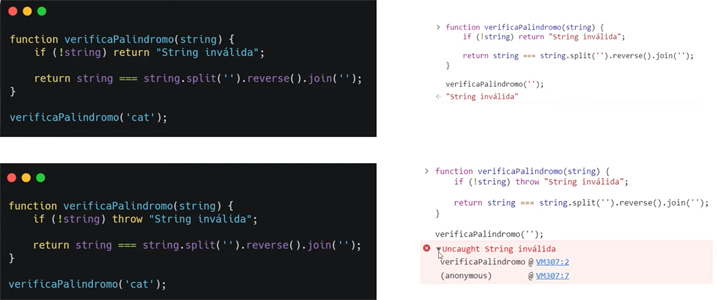
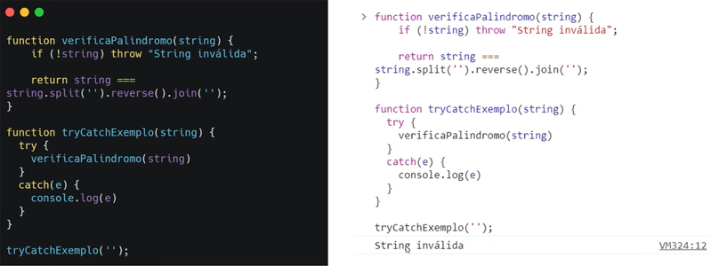
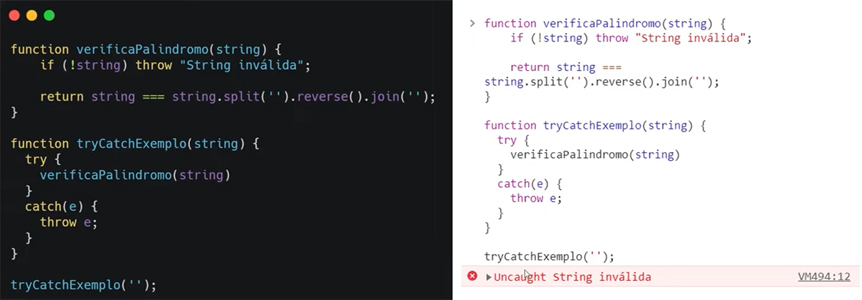
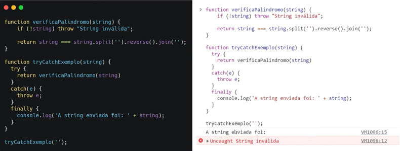
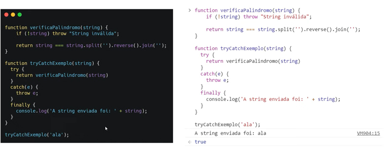
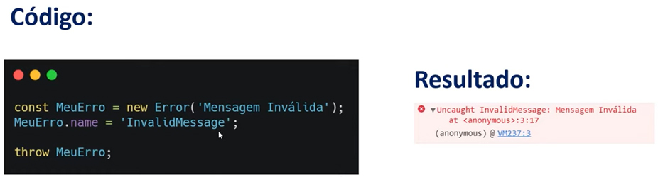
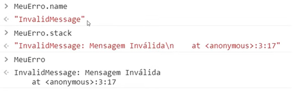

# Tratamento de Erros

- Temos 2 tipos de erros que ocorrem em JavaScript: ECMAScript e DOMException;

---

### ECMAScript

- Ocorrem em tempo de execução, quando o código está rodando dentro da IDE (VSCode) ou sistema operacional (Windows/Mac); alguma variável não foi declarada, falta de vírgula, ponto e vírgula;


---

### DOMException

- Uma excessão ao erro do DOM (Document Object Model), está envolvido quando estamos rodando nosso código em alguma página da web; erros referentes a estrutura da sua árvore de elementos dentro de uma página da web;


---


## Tratando erros

#### **Return**

- Quando temos um return, ele retornará uma *string*, ou seja, uma frase ou palavra que estiverem entre áspas **" "**;

#### **Throw**

- Retorna uma mensagem de **erro** com suas propriedades no JS, quando a função  chamada é uma *string* vazia;



---

### Try...Catch

- Dentro do bloco **try** você verifica um pedaço do código e se tiver algum erro, será capturado na função **catch**; você pode manipular esse erro dentro do **catch** do jeito que quiser, no caso utilzando apenas um `console.log` ou `throw`;

  

  

---

### Finally

- Instrução a ser chamada independente se tem erro ou não;

- erro com uma string vazia;

  


- mensagem confirmando o valor da string;

  

---

### Objeto Error

- Vem do JS e podemos manipular e criar um erro personalizado; mensagem, nome do arquivo e número da linha; todos os parâmetros são opcionais, porém `fileName` e `lineNumber` não são padrão;

  

  - basta criar uma variável e igualar a uma ***"nova instância - new Error"***,  e utilizar a propriedade throw para chamar o erro;

    ```javascript
    const MeuErro = new Error( 'Mensagem Inválida' );
    throw MeuErro;
    ```

  ​

- No **IDE**  o erro também pode ter um nome; basta depois de criar a variável, pego o objeto `MeuErro` e em seguida acrescento a propriedade `.name`;  no resultado vem primeiro o nome do erro e depois a mensagem dele;

  ```javascript
  MeuErro.name = 'InvalidMessage';
  ```

  


- No **console** aparecerá conforme imagem abaixo, e as formas de visualizar o erro: `MeuErro.name`, `MeuErro.stack`*(pilha)*, `MeuErro`;

  

---


