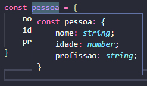

# Typescript

- É como se fosse uma extensão do JS, adiciona várias funcionalidades ao código; checagem de tipos e outras "features"; facilita a escrita do código evitando linhas longas; resultado final de um arquivos typescript é sempre um JS;

- Adiciona definição estática de tipos:
  - Funcionalidades do código mais explícitas;
  - Maior segurança durante o desenvolvimento;
  - Detecta erros durante a compilação que só seriam percebidos em execução;

- Compila um JS mais resiliente;

- Ajuda a desenvolver boas práticas de programação;

- **Define tipo por inferência**: se criarmos uma variável de determinar que o tipo dela é *booleano (true/false)*, ele vai te lembrar sempre que você tentar dar outro valor para aquela variável que não seja um *booleano*;

  ```typescript
  devePrintar: boolean

  let devePrintar = true;
  ```

- **Objetos** também preservam o tipo que foram inicializados em uma variável:

  ```typescript
  const pessoa = {
  	nome: 'Cláudio',
  	idade: 54,
  	profissão: 'desenvolvedor'
  }
  ```

  


---


### Instalação no VSCode

- No terminal digitar: 
  - `npm init` - criar um projeto node;
  - `npm install typescript` - Instalar o typescript;


---


### Setup do ambiente

- **Projeto Node:**
  - Instalar o Node;
    - https://nodejs.org/en/download/
  - Abrir a pasta do projeto com o terminal;
  - Inserir '`npm init`';
  - Confirmar todas as configurações;
- **Typescript:**
  - `npm install -g typescript` (se possível);
  - `npm install typescript`;

---


### Repositório

- Contém um README com dicas de TS;
- Commits feitos com cuidado para explicar uso da ferramenta;
- Documentação com exemplos de uso;
- Exercícios! 
- https://github.com/lira1705/mentoria-typescript

---


