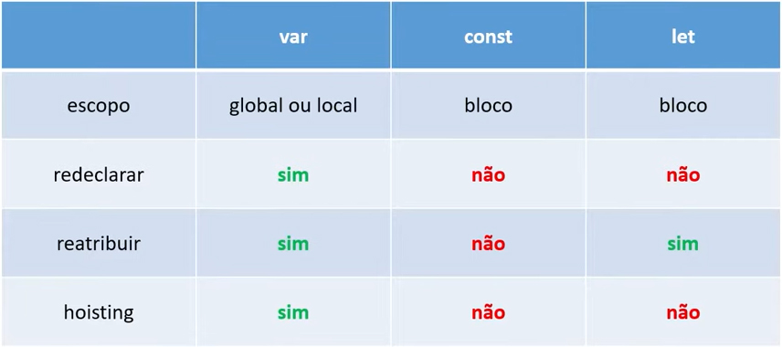

---

---

# JavaScript

## 	Conceitos de Variáveis 

## 	var | let 


1. ### **var**

   primeiro conceito de como declarar variáveis dentro do *JavaScript*, `var` é uma palavra reservada do *JS*; você pode *redeclarar*; é uma variável de *escopo global*, ou seja, pra todo o código mesmo que esteja declarada num escopo específico, no caso de uma *função*, *if*...

   ------

   ​

2. ### **let**

   `let` palavra reservada do *JavaScript* utilizada para declarar uma varíavel dentro de um bloco, pode ser em um *função*, *if*; você não pode *redeclarar*, apenas *reatribuir*.

   `var a = 1;`

   `var b = 2;`

   ​

   ```javascript
   if(a === 1) { //se a é igual a 1
   	var a = 11; //redefini o valor da variável "a" dentro do escopo para 11
   	let b = 22; //declarei a variável "b" dentro do escopo bloco com let para 22

      	console.log(a); //retorna 11
      	console.log(b); //retorna 22
   }
   ```


   `console.log(a);` <!--retorna 11-->

   `console.log(b);` <!--retorna 2 - o valor refere-se a variável declarada fora do escopo de bloco; a variável let só pode ser declarada dentro de um bloco específico e ser chamada dentro dele-->

------

O ideal desde a última atualização do JS é utilizar a variável *let*, desde que seja declarada fora de qq 		escopo para ser tornar *global* dentro de todo código.

------

   ​

3. ### **const**

   são declaradas com o modo *SNAKE_UPPER_CASE*, sempre com letras *maiúsculas* e separadas por *underlines*; utilizadas em escopos de blocos: *funções*, *if*; não faz *hoisting*, precisam ser declaradas no escopo global do código, assim como as variáveis `let`;

   `const DAYS_IN_A_WEEK = 7`;

   `const MY_NAME = "Cláudio"`;

   Não pode ser *redeclarada* ou *reatribuída*, é chamada de **constante** exatamente pelo fato que não se pode modificar;

   `const FIRST_NAME = "Eduardo"`;

   `FIRST_NAME = "André"`;

   <!--pelo fato de constante não poder ser redeclarada ou reatribuída, ou seja, não pode ser mudada, retorna o seguinte erro:-->

   *sleep@DESKTOP-CEBHBM6 MINGW64 /f/Minhas-Anotacoes/Curso-JS/Variaveis (main)*

   *$ node index.js*

   *F:\Minhas-Anotacoes\Curso-JS\Variaveis\index.js:51*

   *FIRST_NAME = "André";*

   ​           ^

   *TypeError: Assignment to constant variable.* 

   \- a variável declarada **FIRST_NAME = "André** é do tipo **hoisting: var**, então ela será lida no início do escopo global, enquanto na mensagem de erro, é uma variável do tipo constante, ou seja, sempre será **Eduardo**, não pode ser mudada.

   ​

   `const LAST_NAME = "Sampaio";`

   `console.log(LAST_NAME);` <!--a constante foi declarada no inicio do escopo e sempre será "Sampaio" até o código parar de rodar-->

   *sleep@DESKTOP-CEBHBM6 MINGW64 /f/Minhas-Anotacoes/Curso-JS/Variaveis (main)*

   *$ node index.js*

   *F:\Minhas-Anotacoes\Curso-JS\Variaveis\index.js:51*

   *Sampaio*

   ------

   ​

4. ### **var, let, const**

   

   ​

   ​

   • **var** - tem *escopo global ou local*, estará disponível tanto dentro de uma função como em qualquer bloco dentro da mesma; posso redeclarar, reatribuir e tem hoisting;

   • **let** - tem *escopo de bloco*, só está disponível dentro do bloco posso *reatribuir*, não posso *redeclarar* e não tem *hoisting (precisa ser declarada e atribuir um valor para ela)*;

   • **const** - tem *escopo de bloco*, **é constante e não muda**; só está disponível dentro do bloco não *reatribuir*, *redeclarar* e não tem *hoisting (precisa ser declarada e atribuir um valor para ela)*;

   ------

   ​

   Conforme a tabela demonstra o ideal é utilizar a variável *let* no **escopo**, como a variável *var* é liberada pode causar problemas de conflitos e confusão em um código longo.

   ------

   ​

   ### Pra saber mais

   [Entenda a diferença entre var, let e const no JavaScript](https://www.alura.com.br/artigos/entenda-diferenca-entre-var-let-e-const-no-javascript?gclid=Cj0KCQjwtvqVBhCVARIsAFUxcRuhHHk_wdwlWmywKaXtlEHBqHdH5uwVG6w97s4gNI_Vl4j2XziLCA4aAkZqEALw_wcB)

   [Var, Let, and Const – What's the Difference?](https://www.freecodecamp.org/news/var-let-and-const-whats-the-difference/)

   [Hoisting - Glossário](https://developer.mozilla.org/pt-BR/docs/Glossary/Hoisting)

   [Convenções de JavaScript](https://www.w3bai.com/pt/js/js_conventions.html#gsc.tab=0)

   [Dicas e boas práticas em JavaScript](https://www.dtidigital.com.br/blog/dicas-e-boas-praticas-com-javascript/)

   ------

   ​

   ​

